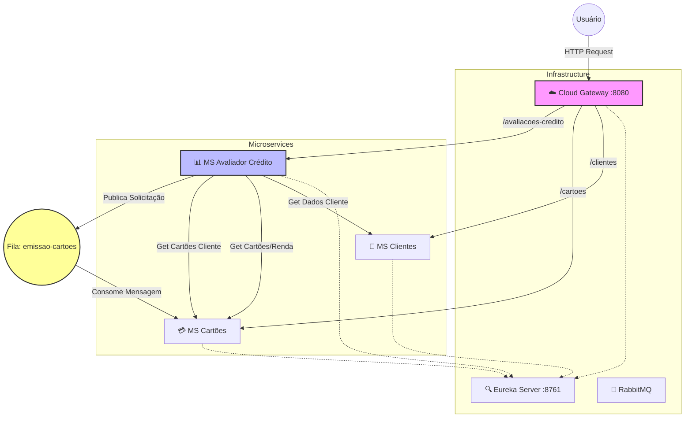

Aqui está um **README.md** organizado e pronto para uso, baseado exatamente nas informações que você enviou, já adaptado para **Markdown padrão do GitHub** (mantendo Mermaid, badges e estrutura clara):

---

# API de Microsserviços: Avaliador de Crédito e Mensageria

<p align="center">
  Este projeto implementa um ecossistema de microsserviços para avaliação de crédito e emissão de cartões, utilizando <strong>Spring Cloud</strong>, comunicação síncrona (<strong>OpenFeign</strong>) e assíncrona (<strong>RabbitMQ</strong>).
</p>

---

## 📊 Arquitetura e Fluxo

O diagrama abaixo ilustra a interação entre os serviços.
O **msavaliadorcredito** atua como **orquestrador**, agregando dados de outros serviços e solicitando processamentos assíncronos.



---

## 🚀 Serviços do Ecossistema

### 🔍 Eureka Server (`eurekaserver`)

Responsável pelo **Service Discovery**.
Todos os microsserviços se registram aqui para permitir comunicação dinâmica sem URLs fixas.

* **Porta:** `8761`

---

### ☁️ Cloud Gateway (`mscloudgateway`)

API Gateway responsável por centralizar o acesso externo e rotear as requisições.

* **Porta:** `8080`
* **Rotas:**

  * `/clientes/**` → `msclientes`
  * `/cartoes/**` → `mscartoes`
  * `/avaliacoes-credito/**` → `msavaliadorcredito`

---

### 👤 MS Clientes (`msclientes`)

Gerencia os dados cadastrais dos clientes.

* **Tecnologias:** Spring Data JPA, H2
* **Dados:** Nome, CPF, Idade

**Endpoints:**

* `POST /clientes` → Cadastra cliente
* `GET /clientes?cpf={cpf}` → Consulta cliente por CPF

---

### 💳 MS Cartões (`mscartoes`)

Responsável por gerenciar tipos de cartões e cartões emitidos.
Também atua como **consumer** da fila RabbitMQ.

**Endpoints:**

* `POST /cartoes` → Cadastra tipo de cartão
* `GET /cartoes?renda={renda}` → Cartões disponíveis por renda
* `GET /cartoes?cpf={cpf}` → Cartões associados ao cliente

---

### 📊 MS Avaliador de Crédito (`msavaliadorcredito`)

Microsserviço **orquestrador**, responsável por integrar os demais serviços.

* Comunicação síncrona via **OpenFeign**
* Comunicação assíncrona via **RabbitMQ**

**Fluxos principais:**

* **Situação do Cliente:** Agrega dados do MS Clientes e MS Cartões
* **Avaliação de Crédito:** Calcula cartões aprovados com base em renda e idade
* **Emissão de Cartão:** Publica mensagem na fila `emissao-cartoes`

---

## 🛠️ Stack Tecnológico

<p align="center">
  
  
  
  
  
</p>

---

## ⚙️ Configuração de Mensageria

O sistema depende da seguinte fila no RabbitMQ, configurada no arquivo `MQConfig.java`:

```text
emissao-cartoes
```

---

## ▶️ Como Executar o Projeto

### 1️⃣ Subir o RabbitMQ

```bash
docker run -it --rm --name rabbitmq \
  -p 5672:5672 \
  -p 15672:15672 \
  rabbitmq:3.9-management
```

* Console de administração: [http://localhost:15672](http://localhost:15672)

  * **Usuário:** guest
  * **Senha:** guest

---

### 2️⃣ Iniciar os serviços (ordem recomendada)

1. **Eureka Server** → porta `8761`
2. **Cloud Gateway** → porta `8080`
3. Microsserviços:

   * `msclientes`
   * `mscartoes`
   * `msavaliadorcredito`

---

## ✅ Observações Finais

* Arquitetura baseada em **microsserviços desacoplados**
* Uso de **Service Discovery**, **API Gateway** e **Mensageria**
* Ideal para estudos de **Spring Cloud**, **OpenFeign** e **RabbitMQ**

---

Se quiser, posso:

* Ajustar o README para **portfólio GitHub**
* Criar uma versão em **inglês**
* Adicionar seção de **exemplos de requisições (cURL / Postman)**
